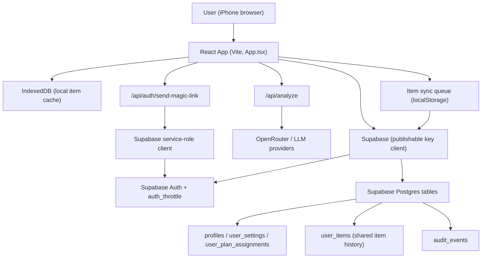

<div align="center">

</div>

# Run and deploy your AI Studio app

This project now ships both the React client and a shared `/api/analyze` endpoint so we can call Gemini, GPT‑4o, and future providers without exposing API keys in the browser.

View your app in AI Studio: https://ai.studio/apps/drive/1-dVV58S55qwbi_q5q6Df_nbJPHZ-Ey1-

## Run Locally

**Prerequisites:** Node.js 18+, Vercel CLI (or another way to serve `/api/*` functions).

1. Install dependencies  
   `npm install`
2. Copy the sample env file and fill in the keys you plan to use  
   `cp .env.local.example .env.local`
3. When developing locally run **both** the Vercel dev server (for API routes) and the Vite client:
   ```bash
   vercel dev          # serves /api/analyze on http://localhost:3000
   npm run dev         # serves the React app on http://localhost:5173
   ```
   The default `.env.local.example` already points `VITE_ANALYZE_URL` at `http://localhost:3000/api/analyze`. Overwrite this variable if your API lives elsewhere.

### Required environment variables

| Variable | Used by | Notes |
| --- | --- | --- |
| `VITE_ANALYZE_URL` | Client | Optional. Defaults to `/api/analyze` in production. Set when the frontend should talk to a remote API instance. |
| `OPENROUTER_API_KEY` | Server | Required. We proxy every request through OpenRouter and expose only its curated model list in the UI. |
| `APPLE_IAP_ISSUER_ID` | Server | App Store Connect API Issuer ID (needed for receipt validation). |
| `APPLE_IAP_KEY_ID` | Server | Key ID associated with the App Store Server API private key. |
| `APPLE_IAP_PRIVATE_KEY` | Server | Contents of the `.p8` private key used to call the App Store Server API. |
| `VITE_SUPABASE_URL` / `SUPABASE_URL` | Client/Server | Supabase project URL for the browser and serverless envs. |
| `VITE_SUPABASE_PUBLISHABLE_KEY` | Client | Publishable key for Supabase Auth (magic links). |
| `SUPABASE_SERVICE_ROLE_KEY` | Server | Service key used in API routes to send magic links and log throttling events. Keep server-side only. |
| `APP_BASE_URL` | Server | Redirect target for Supabase magic links. Must include the scheme, e.g., `https://wecircle-assistent.vercel.app`. |
| `RATE_LIMIT_SALT` | Server | Secret salt used when hashing IPs for throttling login requests. |

Deployments on Vercel should configure these vars in the project settings so that `/api/analyze` can authenticate to OpenRouter at runtime.

### Supabase setup & magic links

1. Install the [Supabase CLI](https://supabase.com/docs/guides/cli) and authenticate once:  
   `npm install -g supabase && supabase login`
2. Link the CLI to your project (replace `abcd1234` with your project ref from the Supabase dashboard):  
   `supabase link --project-ref abcd1234`
3. Apply the checked-in schema:  
   `supabase db push`  
   This executes `supabase/migrations/20260204T000000_initial_product_schema.sql`, which provisions:
   - `profiles`, `user_settings`, and `user_plan_assignments` linked to `auth.users`
   - `billing_plans` plus `usage_counters` for future tier/limit enforcement  
   - `auth_throttle` plus indexes for rate-limiting the magic-link endpoint  
   - RLS policies and triggers that keep `updated_at` automatically in sync.
4. In the Supabase Dashboard → Authentication, enable **Email (Magic Link)** and add production/staging URLs in “Redirect URLs”. Optionally customize the email template for the brand.
5. Set `SUPABASE_URL`, `SUPABASE_SERVICE_ROLE_KEY`, `VITE_SUPABASE_URL`, and `VITE_SUPABASE_PUBLISHABLE_KEY` in `.env.local` and in Vercel project settings.
6. Users can now request a magic link on the login screen; the `/api/auth/send-magic-link` route enforces per-email and per-IP throttling backed by the `auth_throttle` table before calling Supabase Auth. If you get redirected back to the login screen, double-check that `APP_BASE_URL` and the Supabase **Site URL** are set to the same production domain so the session can be exchanged correctly.

## Architecture



Notes:
- `user_settings` and `user_items` are keyed by `user_id`, so the same login shares data across browsers/devices.
- IndexedDB remains local-first for responsiveness; background sync and retry queue make remote writes fault tolerant.
- `audit_events` captures item lifecycle and auth lifecycle events for traceability.

## Quality gates (linting & tests)

Before pushing or deploying, run the checks that Vercel also executes during `npm run vercel-build`:

- `npm run lint` – ESLint (TypeScript + React rules) with warnings treated as failures.
- `npm run test` – Vitest in CI mode (runs the suite with JSDOM).
- `npm run typecheck` – Ensures the TypeScript project compiles with `tsc --noEmit`.

Vercel reads `vercel.json` and executes `npm run vercel-build`, which chains the three commands above before `vite build`. Any failing step stops the deployment.

### Local pre-push guard

This repo now includes a git pre-push hook at `.githooks/pre-push` that runs `npm run vercel-build` before pushes, so lint/test/typecheck/build failures are caught locally first.
